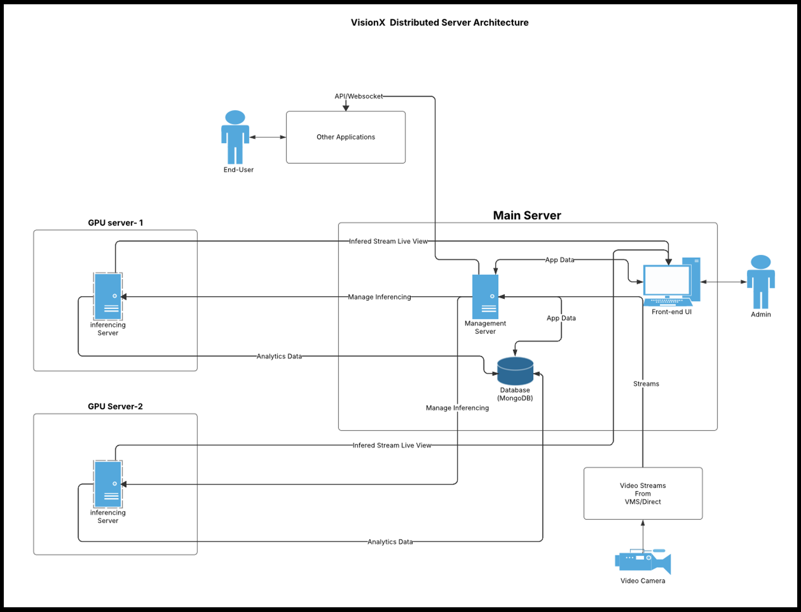

### Distributed Server Architecture (Large deployments)

---

## Modular Scalable Design
- Architecture separates the workload across a **Main Server** and multiple **GPU Inference Servers**.  
- Designed for **high-volume, high-performance** scenarios.

---

## Distributed Inference
- Multiple **GPU Servers** (e.g., GPU-1, GPU-2) handle inference in parallel.  
- Each inference server sends back **analytics** and **inferred stream data**.

---

## Centralized Management
- The **Management Server** (in the main server) handles **stream assignment**, **data routing**, and **system control**.  
- **MongoDB** aggregates analytics from all inference servers.

---

## User Interfaces
- **Admins** monitor and manage the system via the **Frontend UI**.  
- **End-users** and external systems interact via **APIs/WebSocket**.

---

