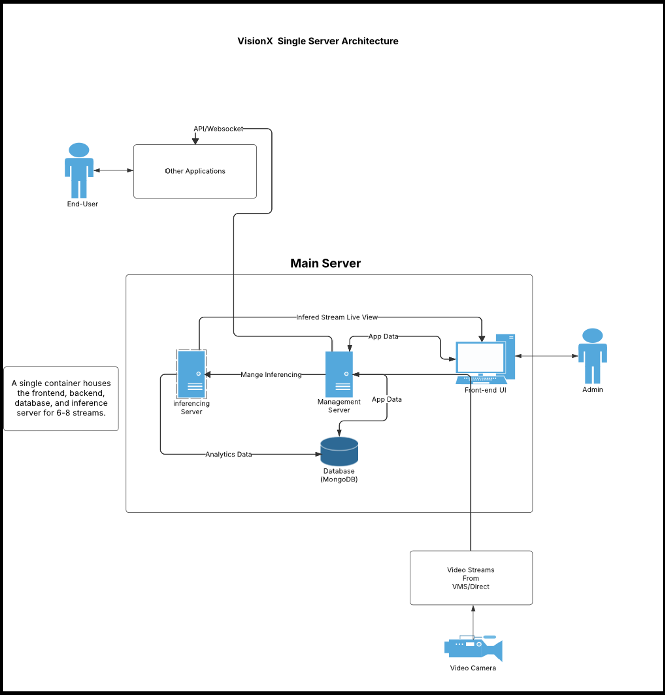

### Single Server Architecture (up to ~15 cameras / small deployments)

---

## ● All-in-One Deployment
- A single container hosts the **Frontend UI**, **Backend Management Server**, **Inference Engine**, and **MongoDB Database**.  
- Supports **real-time processing** for up to **6–8 video streams**.

---

## ● Video Input
- Video streams are received directly from **cameras** or via **VMS systems**.

---

## ● Inference & Data Flow
- The **Inference Server** processes video streams and generates **analytics**.  
- The **Management Server** controls inferencing and manages **application data**.  
- The **MongoDB Database** stores analytics and app-related data.

---

## ● User Interfaces
- **Admins** access real-time inferred video streams through the **Frontend UI**.  
- **End-users** and third-party apps connect via **APIs/WebSocket**.

---

