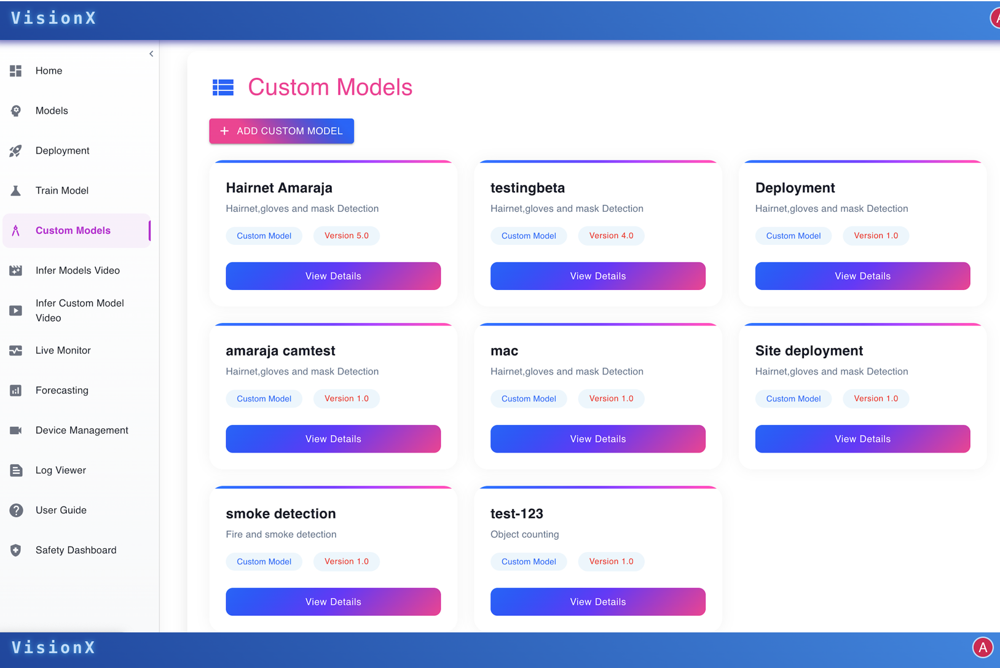
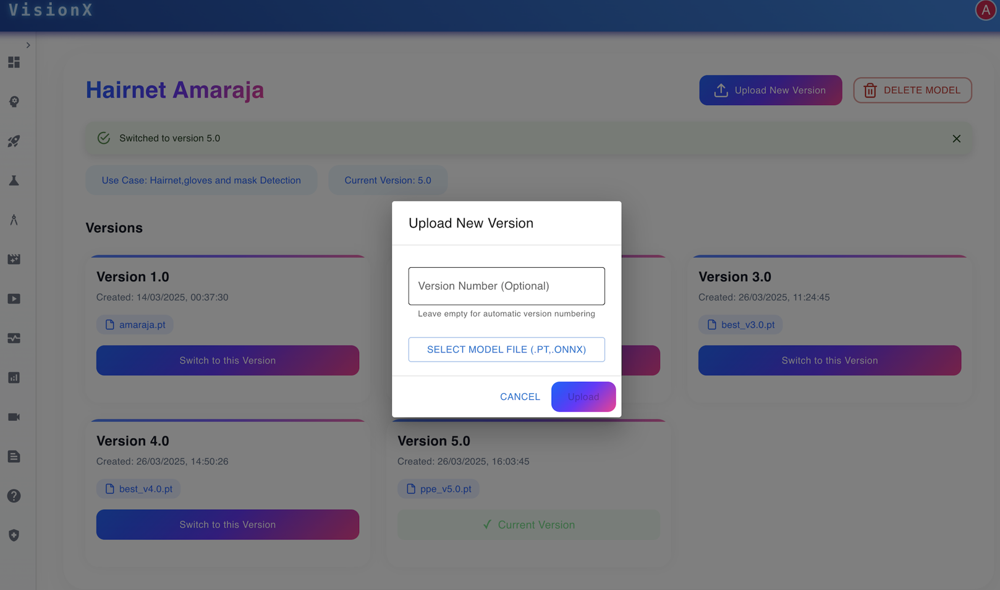

# Custom-Trained Models

**VisionX** enables users to train AI models using their own datasets to meet unique business needs.  

---

---

This allows for:
- Fine-tuning accuracy  
- Handling niche scenarios  
- Adapting to specialized environments  

By leveraging custom datasets, organizations can ensure the AI model aligns precisely with their operational goals and context.

## Version Control of Custom Models

**VisionX** provides robust version control for custom-trained models, enabling teams to manage their AI development lifecycle with confidence and transparency.

---

---

### Benefits
- Track and document model changes across versions  
- Compare performance metrics between different iterations  
- Roll back to previous versions when required  
- Maintain detailed version history for auditing and analysis  
- Support safe experimentation without compromising production stability  

With VisionX’s version control, organizations can manage, evaluate, and evolve their custom-trained models safely and effectively—ensuring sustained AI performance and compliance over time.
