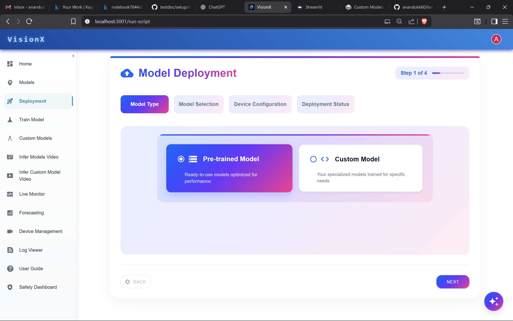
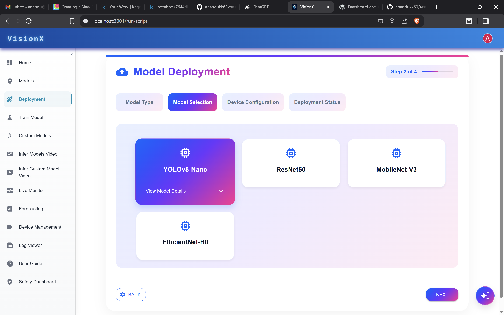
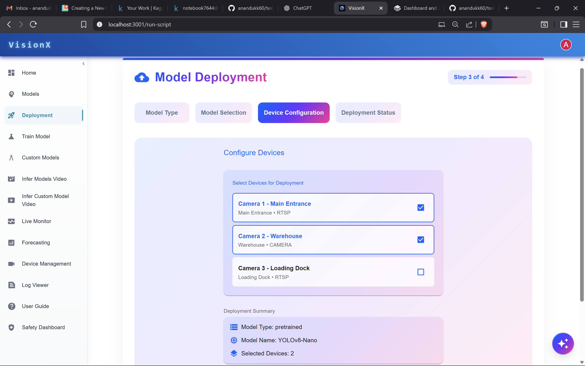

# Model Deployment

This page describes how to deploy models to production.

## Deploy a model

### Prerequisites
- You have a trained model (pre-trained or custom).
- You have one or more target devices registered and reachable.
- Appropriate permissions to deploy to the selected devices.

### Steps
1. Select whether the model is **Pre-trained** or **Custom**, then click **Next**.  

---

2. Choose the model(s) from the list, then click **Next**.  

---

3. In the **Device Configuration** tab, select the devices where the model should run inference. Configure any device-specific settings if required.  

---

4. Click **Deploy** to start the deployment.

5. View the deployment status

### Expected results
- The model runs inferencing on the selected devices.
- The deployment status shows progress and final state (e.g., Success, Failed).

### Troubleshooting
- If deployment fails, check device connectivity and logs.
- Verify model compatibility with device runtime and available resources.
- Retry deployment after resolving any errors.
