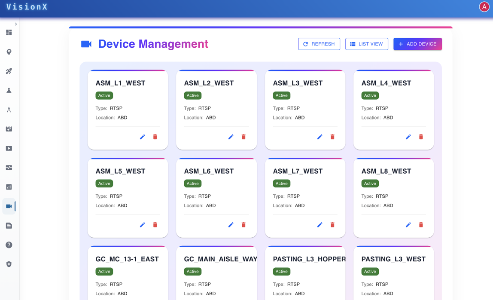
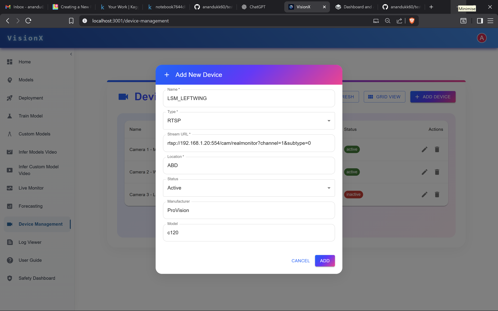

# Device Management

**VisionX** offers seamless device management, enabling users to add, delete, and organize devices effortlessly.  

Models can be deployed directly to selected devices, with support for assigning specific models to specific devices based on the use case.  

This ensures optimized performance, scalability, and centralized control across all connected devices.

---

---

## Key Features
- Add, delete, and organize devices easily
- Deploy models directly to selected devices
- Assign specific models to specific devices
- Centralized management and monitoring
- Scalable deployment for multi-device environments

### Steps to add a new device
1. Click **Add New Device**  
   - Open the device management page and select the option to add a new device.

2. Enter device details  

---

   - Fill in the required fields:  
     - **Name**  
     - **Type of Device**  
     - **Stream URL**  
     - **Location**  
     - **Status**  
     - **Manufacturer**  
     - **Model**

3. Add the device  
   - After entering all information, click the **Add** button to save the new device.

## Benefits
- Simplifies device administration
- Enhances operational efficiency
- Ensures consistent performance across devices
- Supports flexible model assignment for diverse applications