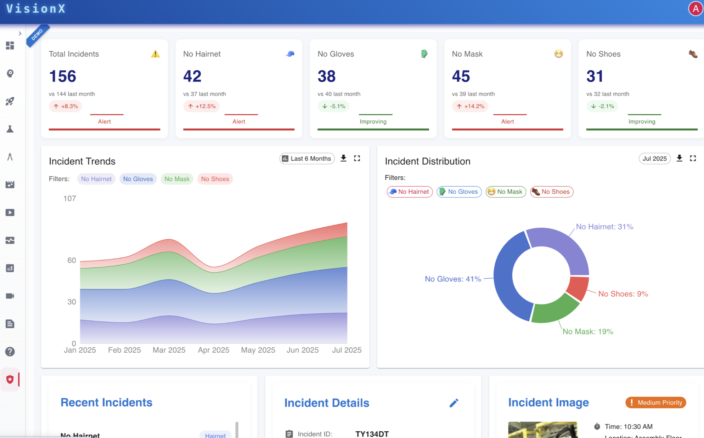

# Dashboard and Analytics

The **VisionX Incident Dashboard** provides a comprehensive, real-time overview of incidents within a facility.
---

---
## Example KPIs and Analytics Tracked

1. **Real-Time Incident Monitoring**  
   Live tracking of safety violations (e.g., no gloves, no mask, etc.)

2. **Category-Wise Incident Breakdown**  
   Incident counts grouped by type (e.g., No Hairnet, No Shoes)

3. **Trend Analysis**  
   Visual representation of incident trends over a six-month period

4. **Incident Distribution Analytics**  
   Percentage breakdown by violation type via donut chart

5. **Performance Comparison**  
   Month-over-month comparison for each violation type with percentage change

6. **Alert & Status Indicators**  
   Highlights improvements or alerts based on performance thresholds

7. **Incident Logging & Details**  
   Detailed view of individual incidents, including time, location, and ID

8. **Visual Evidence Support**  
   Image capture of incidents for verification and review

9. **Filterable & Interactive Charts**  
   Enable/disable specific categories in trend and distribution views

10. **User Interface Navigation**  
    Sidebar for quick access to cameras, reports, settings, and more

## Benefits
- Real-time insight into safety and compliance
- Improved data-driven decision-making
- Enhanced visibility into operational trends
