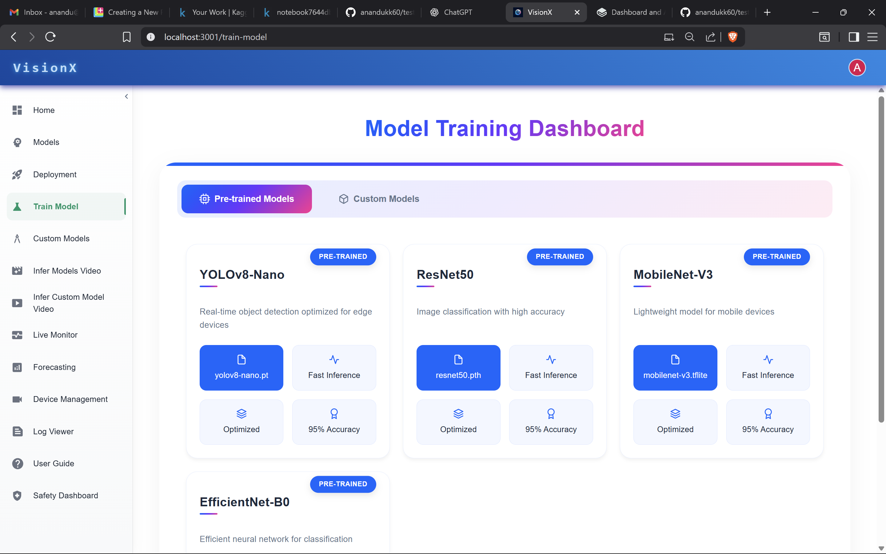
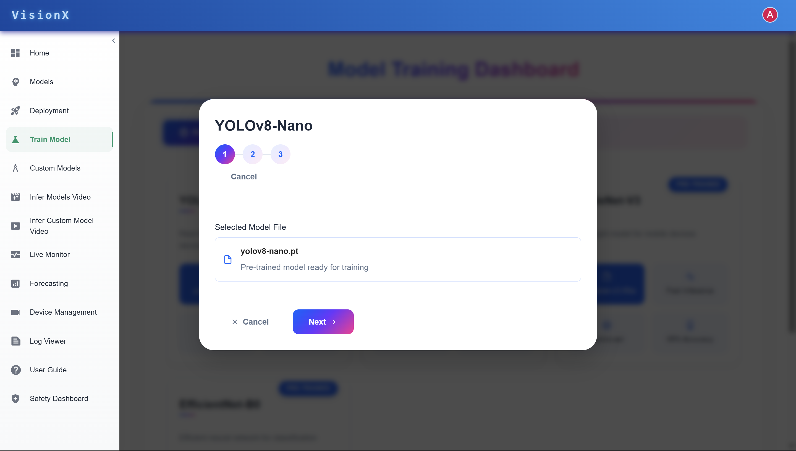
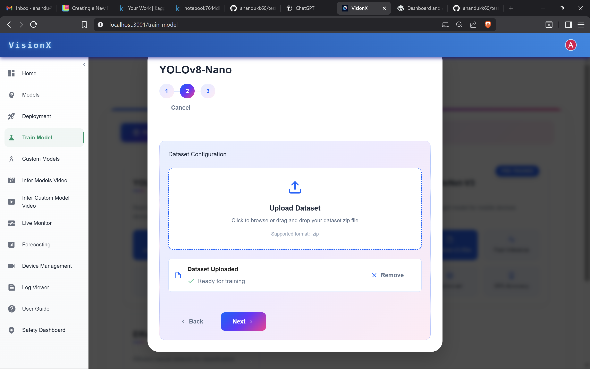
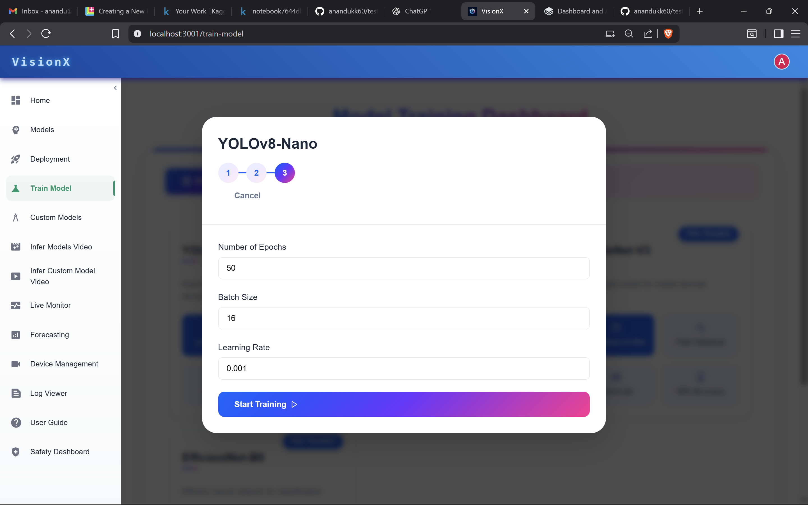

# Model Training

This page describes how to start training a model using a selected architecture and dataset.

---

---

## Train a model

### Prerequisites
- A model available (Pre-trained or Custom).
- A prepared dataset in a supported format and accessible for upload.
- Sufficient compute resources and permissions to run training.

### Steps
1. Select a model  

---

   - Choose either **Pre-trained** or **Custom** from the model list.  
   - Click **Next**.

2. Upload a dataset  

---

   - Upload or select the dataset to use for training (ensure format and labels are correct).  
   - Click **Next**.
   
3. Configure training and start  

---

   - Set the number of epochs, batch size, and learning rate.  
   - Click **Start Training** to begin the job.

### Troubleshooting
- If training fails, check dataset format, data paths, and logs for errors.
- Adjust learning rate, batch size, or number of epochs if training is unstable or not converging.
- Verify compute resource availability.

