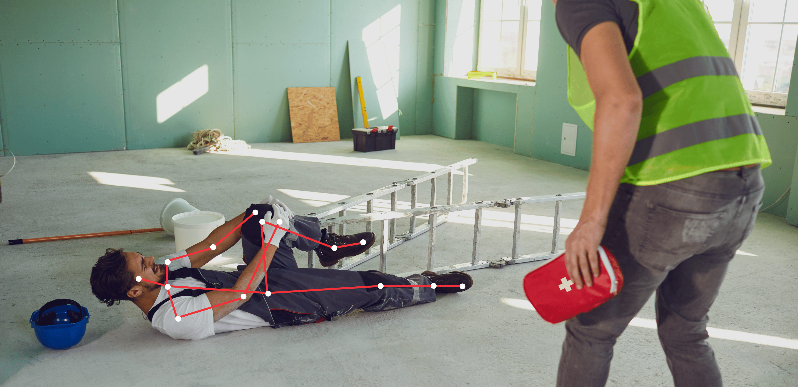

# Fall Detection
Detects human falls using pose estimation and temporal analysis. Important for healthcare, elderly care, and workplace safety.

---

---

**Industry Use Cases:**
- **Healthcare & Elderly Care:** Monitor patients or elderly individuals for safety.  
- **Smart Homes:** Enable real-time alerts for home-assisted living environments.  
- **Workplace Safety:** Detect worker accidents in factories or construction sites.  
- **Nursing Homes:** Automatic alerting systems for caregivers.  

---