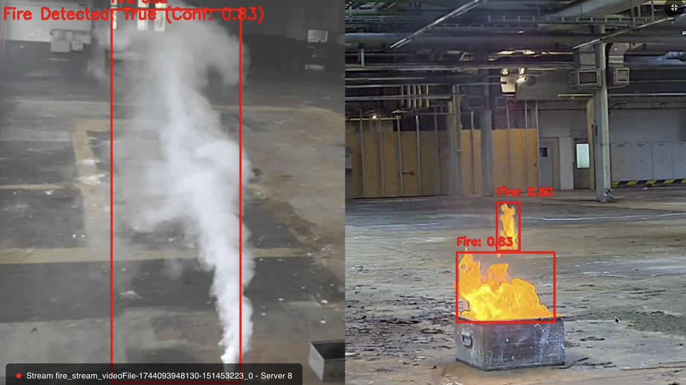

# Fire Detection
Detects visual signs of fire or smoke from CCTV feeds to provide early warnings and reduce response time.

---

---

**Industry Use Cases:**
- **Industrial Facilities:** Early fire detection in plants and refineries.  
- **Commercial Buildings:** Automated fire alarm systems via CCTV integration.  
- **Forestry & Environmental Monitoring:** Detect wildfires at an early stage.  
- **Transportation Hubs:** Rapid fire alerts in tunnels, stations, or airports.  

---