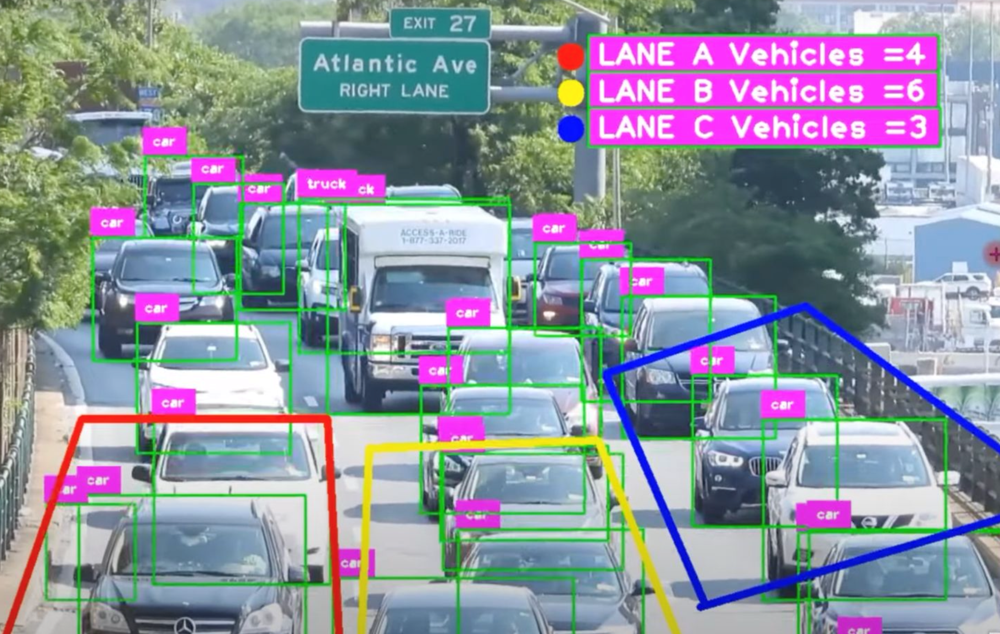

# Heatmap Counting
Detects and visualizes concentration of moving objects (e.g., vehicles) in predefined zones using heatmap overlays. Useful for traffic density monitoring and hotspot analysis.

---

---

**Industry Use Cases:**
- **Smart Cities & Traffic Management:** Identify congestion hotspots; optimize signal timings.  
- **Retail & Shopping Malls:** Analyze foot traffic to optimize store layouts or staff allocation.  
- **Event Management:** Monitor crowd density for safety and evacuation planning.  
- **Industrial Plants:** Track worker or equipment movement to improve workflow efficiency.  

---