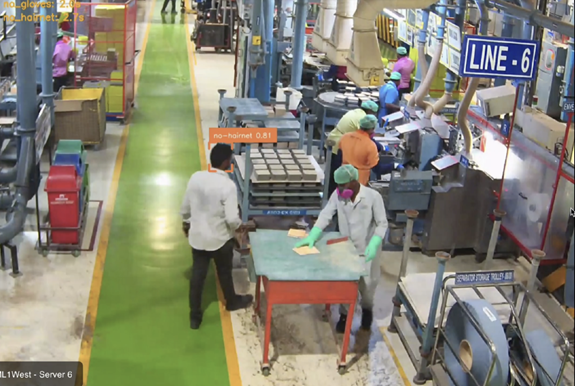

# Helmet and Safety Vest Detection
Detects PPE compliance such as helmets and safety vests for worker safety and regulatory compliance.

---

---

**Industry Use Cases:**
- **Construction Sites:** Monitor and enforce worker PPE compliance.  
- **Mining Operations:** Enhance worker safety with automated compliance checks.  
- **Manufacturing Plants:** Real-time safety audits for workers in restricted zones.  
- **Oil & Gas Facilities:** Enforce PPE adherence in hazardous environments.  

---