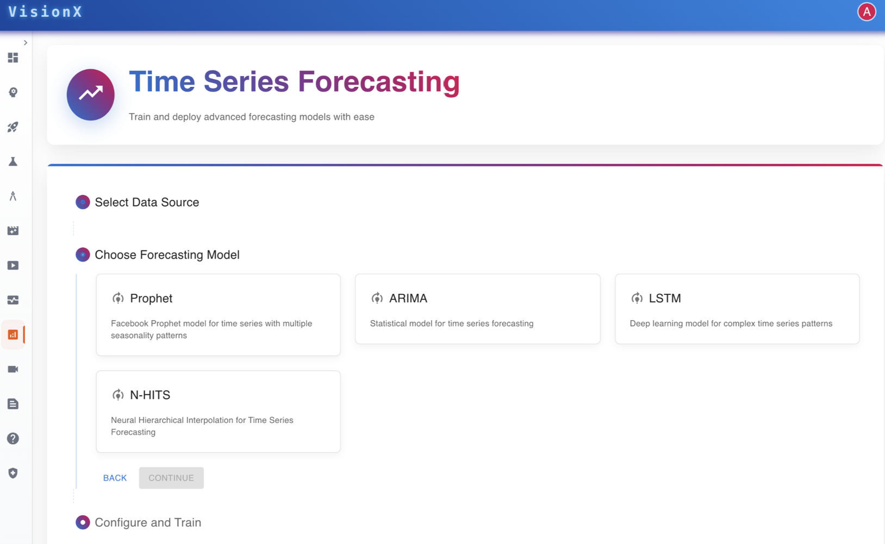

# Time Series Forecasting

**VisionX** supports time series forecasting to predict future values based on historical data.  

For example, the expected number of safety violations can be predicted using past data.  

This enables proactive decision-making, resource planning, and timely interventions.

---

---

## Use Cases
- Predict future incident or violation rates
- Identify high-risk periods in operations
- Plan resources and schedules effectively
- Anticipate maintenance and safety requirements

## Benefits
- Enhanced workplace safety through early insights
- Data-driven risk management
- Improved efficiency and preparedness
- Adaptable forecasting for any customer-specific use case
