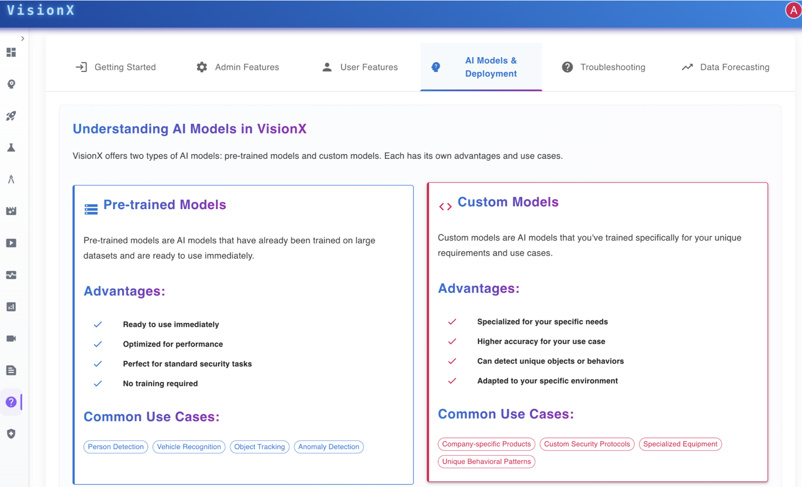

# User Manual and Support

The **User Manual** page in VisionX serves as a centralized guide to help users understand and utilize AI models effectively.  

---

---

It categorizes information under sections such as:
- Getting Started  
- Admin Features  
- User Features  
- AI Models & Deployment  
- Troubleshooting  
- Data Forecasting  

